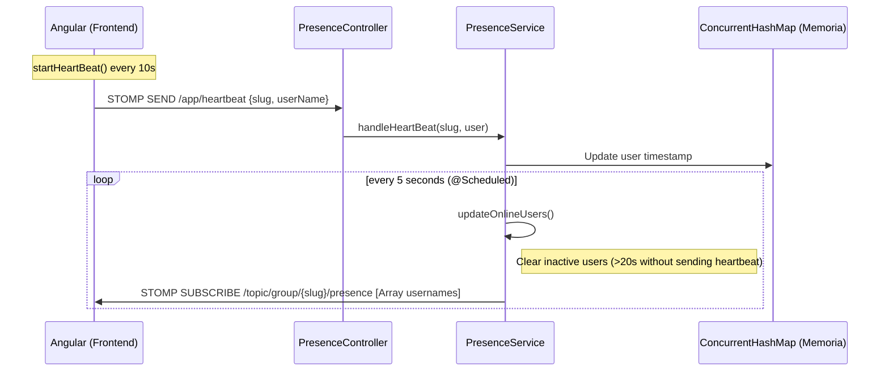

# 🗓️ SlotMatch - Group Availability Visualizer

**DISCLAIMER: This project is hosted with a free plan, meaning that backend needs between 30 and 60 seconds to start working**

SlotMatch is a collaborative tool designed to solve a problem I have with my friends: "when should we meet?". For this purpose, SlotMatch uses a real-time heat map to instantly visualize the best available times for a group.

---

## 🚀 Stack

### Backend


### Frontend


### Realtime Communication 


## TODO
* Finish endpoint documentation
* Add control and validation when creating users and groups
* Handle exceptions and errors properly using @ControllerAdvice and @ExceptionHandler
* Review and adjust existing front-end component and interfaces

## Ideas / New Features
* When in a group, show all members of the group highlighting online users ✅
* On the home page, display the names of the groups of which the user is a member
* When creating a group, user can secure it with a password so the password is needed to join
* On hovering a cell on heatMap calendar show which users are available (not only av_users / total_users)
* Whatsapp / Telegram integration via join link

## Documentation
### 🧩 Realtime Communication (WebSockets)
#### Live Users
Following diagram shows how clients interact with backend via WebSockets to announce their presence and also to receive the list of online users



#### Real-Time HeatMap Synchronization
The following diagram shows how the real-time update of the group calendar has been implemented
```mermaid
sequenceDiagram
    autonumber
    participant User as User (CalendarComponent)
    participant API as AvailabilityController
    participant Service as AvailabilityService
    participant DB as Database (PostgreSQL/MySQL)
    participant Broker as WebSocket Broker (STOMP)
    participant Group as Other Members (HeatmapComponent)

    Note over User, Group: All users are subscribed to /topic/group/{id}/updated

    User->>API: POST /calendar/save (UserAvailabilityDTO)
    API->>Service: saveCalendar(dto)
    
    rect rgb(240, 248, 255)
        Note over Service, DB: Transactional Context
        Service->>DB: deleteByUserId(userID)
        Service->>DB: saveAll(newSlots)
        Service->>Service: Register Synchronization (afterCommit)
    end

    DB-->>Service: Transaction Committed Success
    
    Note right of Service: Trigger afterCommit() logic
    Service->>Broker: SEND /topic/group/{id}/updated "REFRESH"
    
    Broker-->>Group: Broadcast "REFRESH" Message
    
    Note over Group: WebsocketService receives event
    Group->>API: GET /groups/getHeatMap/{id}
    API-->>Group: Return updated HeatMapResponseDTO
    Note over Group: UI updates with new intensities
  ```

### Endpoints


| **Module**       | **Method** | **Endpoint**   | **Input (Body / Path Var)** | **Output (DTO / Msg)** | **Description**                                                       |
| ---------------- | ----------------- | -------------------------------- | --------------------------- | ---------------------- | --------------------------------------------------------------------- |
| **Availability** | `POST`            | `/calendar/save`                 | `UserAvailabilityDTO`       | `void` (200 OK)        | Save user availability and triggers global REFRESH.          |
| **Availability** | `GET`             | `/calendar/load`                 | `?username={string}`        | `List<Availability>`   | Carga la disponibilidad guardada de un usuario específico.            |
| ---------------- | -----------       | --------------------             | ---------------             | -----------            | ----------------------------------------------------------            |
| **Groups**       | `POST`            | `/groups/create`                 | `GroupNameDTO`              | `CalendarGroup`        | Crea un grupo nuevo y genera su identificador único (Slug).           |
| **Groups**       | `GET`             | `/groups/{slug}`                 | `{slug}` (String)           | `CalendarGroup`        | Obtiene los detalles de un grupo mediante su slug de acceso.          |
| **Groups**       | `POST`            | `/groups/newGroupMember`         | `GroupMember`               | `GroupMember`          | Registra formalmente a un usuario como miembro de un grupo.           |
| **Groups**       | `GET`             | `/groups/getHeatMap/{groupId}`   | `{groupId}` (Long)          | `HeatMapResponseDTO`   | Obtiene el cálculo de densidades de horarios para el Heatmap.         |
| **Groups**       | `GET`             | `/groups/getUserName/{userId}`   | `{userId}` (String)         | `{"userName": string}` | Traduce un ID de usuario a su nombre legible.                         |
| **Groups**       | `GET`             | `/groups/{groupId}/members`      | `{groupId}` (Long)          | `List<GroupMember>`    | Lista todos los integrantes de un grupo específico.                   |
| **Presence**     | `SEND`            | `/app/heartbeat`                 | `HeartBeatMessage`          | `void`                 | Envío de latido (slug + user) para mantener el estado online.         |
| **Presence**     | `SUB`             | `/topic/group/{slug}/presence`   | `{slug}` (String)           | `List<String>`         | Suscripción para recibir la lista de usuarios activos en tiempo real. |
| **Sync**         | `SUB`             | `/topic/group/{groupId}/updated` | `{groupId}` (Long)          | `"REFRESH"` (String)   | Canal de notificación para forzar la recarga del calendario.          |
